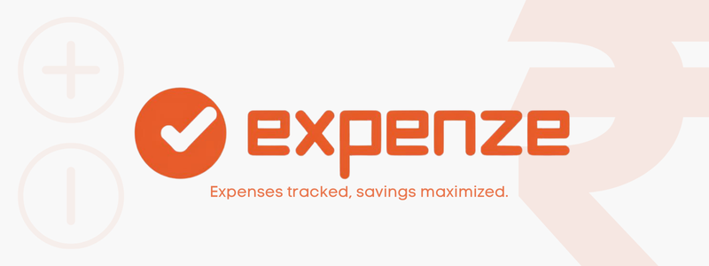
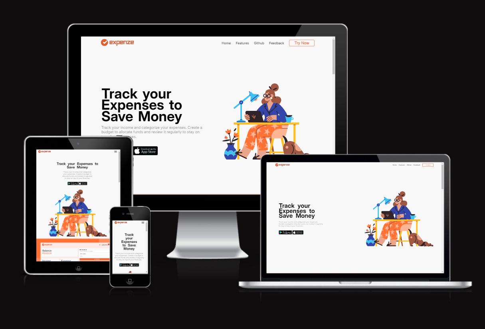

<div align="center">
  
</div>
<div align="center">
  
  
  
  
</div>


# 

**```Expenze```** is a user-friendly and mobile-friendly web application designed to help you monitor your daily expenses, track income, and maintain a detailed transaction history. With a clean and intuitive dashboard, users can easily add, edit, and delete transactions. The application includes features such as login, signup, and a convenient option to print the transaction history, making financial tracking simpler and more accessible.


<br>

## Table of Contents

- [Key Features](#key-features)
- [Project Structure](#project-structure)
- [Check Respoonsive](#check-responsive)
- [Concepts Used](#concepts-used)
- [Future Scope](#future-scope)

<br>

## Key Features

- **Track Income and Expenses**: Add income and expenses through a simple form with validation to prevent negative balance transactions.
- **Detailed Transaction History**: View a table of all transactions, sortable and editable, with options to delete individual entries.
- **CRUD Operations**: Perform Create, Read, Update, and Delete operations on transactions seamlessly within the app.
- **Login and Signup**: Implemented using local storage, allowing users to manage their own accounts and data.
- **Balance Calculation**: Automatically calculates the balance based on transactions, showing income and expenses separately.
- **Print History**: Provides the ability to print the transaction history directly from the application.
- **Responsive Design**: Built with CSS Grid and media queries to ensure the application looks great on all devices.


[🔝](#table-of-contents)

<br>

## Project Structure 

```bash
Expense-Tracker/
├── Images/                   # Folder containing images for icons , backgrounds etc.
├── Scripts/                  # JavaScript files
│   ├── dashboard.js          # Core functionality (CRUD operations, transaction handling , print history)
│   ├── login.js              # Login, signup, and user validation logic
│   ├── index.js              # Scripts for the landing page
├── Styles/                   # CSS files for styling
│   ├── dashboard.css         # Styles for the dashboard
│   ├── login.css             # Styles for login and signup pages
│   ├── index.css             # Styles for the landing page
├── index.html                # Landing page of the application (entry point)
├── login.html                # Login and signup page
├── dashboard.html            # Main application dashboard
├── README.md                 # Project documentation
```
[🔝](#table-of-contents)

<br>

## Check Responsive

Expenze is designed with a mobile-first approach, ensuring a seamless experience across all devices. Click the image below to view the app's responsive design in action.

<div align="center">
  <a href="https://ui.dev/amiresponsive?url=https://priyamaggarwal18.github.io/Expense-Tracker/" target="_blank">
    
  </a>
</div>


## Concepts Used

- **JavaScript Classes**: Utilized to encapsulate user data and transactions, providing a clean and structured approach to managing user operations.
- **Local Storage**: Used for storing user information and transactions securely on the client side.
- **Event Handling**: Handled form submissions, button clicks, and other user interactions to update the UI dynamically.
- **DOM Manipulation**: Implemented using JavaScript to create, update, and delete elements in the DOM based on user actions.
- **Responsive Design**: Built with CSS Grid and Flexbox to ensure a seamless experience across different screen sizes, including desktops, tablets, and mobile devices.
- **Custom Alerts and Prompts**: Created custom modals to handle alerts and prompts for a more engaging user experience.
- **Input Validation**: Added validation to forms to prevent invalid transactions, including checks for negative balances.
- **Print Feature**: Implemented a method to print the transaction history directly using JavaScript.

[🔝](#table-of-contents)

<br>

## Future Scope
To further enhance the **Expense Tracker**, the following features are planned to provide a more personalized and secure user experience:

- **Custom Profile Editing**: Implement a dedicated profile management page where users can update their personal information, including username and email.
- **Upload Profile Picture**: Allow users to upload a profile picture that will be displayed on the dashboard and profile page. The uploaded image will be stored in local storage to retain changes across sessions.
- **Password Update**: Provide a secure mechanism for users to update their passwords, with appropriate validations to ensure strong password policies are followed.
- **Enhanced User Interface**: Introduce additional user interface elements like a dashboard with more customization options and detailed user statistics.
- **Additional Security**: Add features like logout timers and session expiration to further enhance the security of user data stored in local storage.

These features aim to give users more control over their profiles and improve the overall user experience.

<br>

# 
<div>
  
  <h3 align="left">Maintained By - Priyam Aggarwal (https://github.com/priyamaggarwal18)</h3>
    <a href="https://priyamaggarwal18.github.io/Portfolio2.0/" target="_blank" style="text-decoration: none;">
    
  </a>&nbsp&nbsp;
  <a href="https://www.linkedin.com/in/priyamaggarwal" target="_blank" style="text-decoration: none;">
  
</a>&nbsp&nbsp;
</div>
